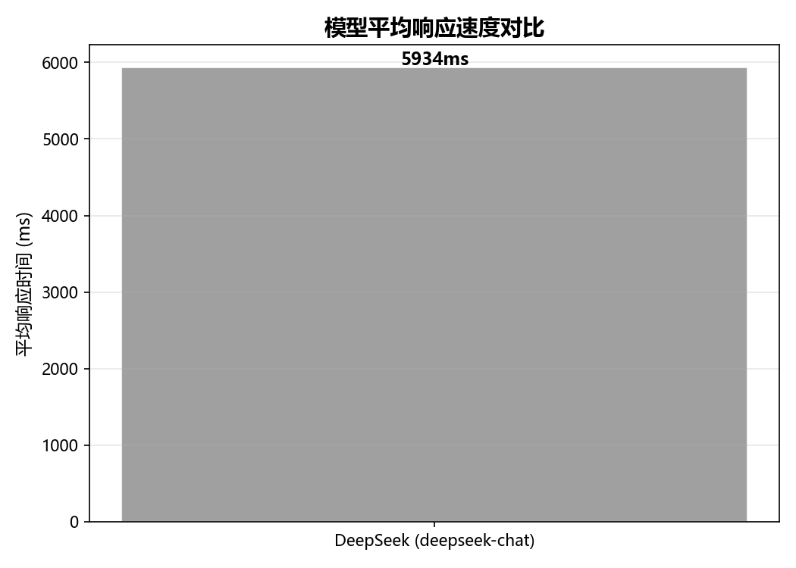

# 大模型 Prompt 效果评测框架

> LLM Prompt Evaluation Framework  -  可扩展的多模型 Prompt 评测框架,支持自定义场景/维度/模型接入

[](https://python.org)
[](LICENSE)

## 目录

- [项目简介](#项目简介)
- [项目特性](#项目特性)
- [项目结构](#项目结构)
- [快速开始](#快速开始)
- [DeepSeek-V3 评测结果](#deepseek-v3-评测结果)
- [架构设计](#架构设计)
- [评测维度设计](#评测维度设计)
- [Prompt 数据集设计](#prompt-数据集设计)
- [接入真实 API](#接入真实-api)
- [扩展指南](#扩展指南)
- [License](#license)

## 项目简介

本项目是一套**可扩展的 LLM Prompt 效果评测框架**,核心能力包括:

1. **Prompt 数据集管理**  -  结构化的 JSON 数据集,每条 Prompt 附带参考答案和评分权重配置
2. **多模型接入层**  -  策略模式封装 API 调用,仅使用 Python 标准库,零第三方 SDK 依赖
3. **多维度自动评分**  -  基于规则引擎的 5 维评分体系(准确性/逻辑性/安全性/完整性/流畅性)
4. **可视化与报告**  -  自动生成雷达图/柱状图/热力图/延迟图 + 结构化 Markdown 报告

**当前评测实例**: 基于 DeepSeek-V3 API,对 6 类场景 21 组 Prompt 进行了真实评测.框架架构同时支持接入 ChatGPT,Claude 等模型(需要对应 API Key).

## 项目特性

- **6 大场景覆盖**  -  问答/摘要/代码/推理/翻译/创意写作,每类 3~4 组精心设计的 Prompt
- **可扩展模型接入**  -  策略模式设计,新增模型只需实现 `generate()` 方法,框架自动完成评测调度
- **5 维评分体系**  -  准确性/逻辑性/安全性/完整性/流畅性,每题可自定义权重配置
- **4 种可视化图表**  -  雷达图(能力轮廓) + 分组柱状图(场景对比) + 热力图(矩阵总览) + 延迟图(响应速度)
- **零额外依赖**  -  API 客户端仅使用 Python 标准库 `urllib`,不依赖任何第三方 SDK
- **自动化报告**  -  一键生成结构化 Markdown 评测报告,包含逐题明细/模型画像/选型建议
- **双模式运行**  -  Mock 模式离线测试框架流程;Real 模式调用真实 API 获取数据

## 项目结构

```
llm-prompt-eval/
├── main.py                          # 主入口  -  命令行工具,串联全流程
├── requirements.txt                 # Python 依赖
├── README.md
├── data/
│   ├── prompts/                     # Prompt 数据集(输入)
│   │   ├── qa.json                  # 问答类 (4 组)
│   │   ├── summarization.json       # 摘要类 (4 组)
│   │   ├── code.json                # 代码类 (4 组)
│   │   ├── reasoning.json           # 推理类 (3 组)
│   │   ├── translation.json         # 翻译类 (3 组)
│   │   └── creative_writing.json    # 创意写作类 (3 组)
│   └── evaluation_results/          # 评测结果(输出)
│       ├── test_fixtures.json       # 开发测试用 Mock 数据
│       └── evaluation_results.json  # 最新评测结果(真实 API 数据)
├── src/
│   ├── __init__.py
│   ├── api_clients.py               # API 客户端  -  策略模式封装(Mock/DeepSeek/OpenAI/Claude)
│   ├── evaluator.py                 # 评测引擎  -  并发调度 + 结果管理
│   ├── metrics.py                   # 评分指标  -  5 维度规则引擎
│   ├── visualization.py             # 可视化  -  雷达图/柱状图/热力图/延迟图
│   └── report.py                    # 报告生成  -  Markdown 结构化报告
├── notebooks/
│   └── analysis.ipynb               # 交互式分析 Notebook
└── outputs/
    ├── figures/                     # 生成的图表(PNG)
    │   ├── radar_comparison.png     #   雷达图
    │   ├── bar_category_comparison.png  #   分组柱状图
    │   ├── heatmap_comparison.png   #   热力图
    │   └── latency_comparison.png   #   延迟对比图
    └── reports/
        └── evaluation_report.md     # 评测报告(Markdown)
```

## 快速开始

```bash
# 1. 安装依赖
pip install -r requirements.txt

# 2. Mock 模式  -  离线测试框架流程(无需 API Key)
python main.py

# 3. 真实 API 模式  -  设置环境变量后运行(支持多个,配了哪个用哪个)
export DEEPSEEK_API_KEY="sk-..."     # DeepSeek
export OPENAI_API_KEY="sk-..."       # ChatGPT (可选)
export ANTHROPIC_API_KEY="sk-..."    # Claude (可选)
python main.py --real

# 4. 仅重新生成报告(基于已有评测结果,不重新调用 API)
python main.py --report-only

# 5. 单 Prompt 快速测试
python main.py --prompt QA-001

# 6. Jupyter Notebook 交互式分析
cd notebooks && jupyter notebook analysis.ipynb
```

## DeepSeek-V3 评测结果

> 以下数据来自 DeepSeek-V3 API 真实调用,共评测 21 个 Prompt,评分由规则引擎自动生成.

### 综合评分(5 维度均值)

| 模型 | 准确性 | 逻辑性 | 安全性 | 完整性 | 流畅性 | **综合分** |
|------|--------|--------|--------|--------|--------|----------|
| DeepSeek-V3 | 6.73 | 6.20 | 9.00 | 7.33 | 8.43 | **7.27** |

### 分类能力对比

| 分类 | 综合分 | 难度分布 |
|------|--------|---------|
| 推理 | 8.23 | medium / hard |
| 问答 | 8.05 | easy / medium / hard |
| 创意写作 | 7.67 | easy / medium / hard |
| 摘要 | 7.08 | easy / medium / hard |
| 代码 | 7.38 | easy / medium / hard |
| 翻译 | 4.97 | easy / medium / hard |

> 翻译类评分较低是因为规则引擎的关键词匹配方式难以评估翻译质量 - 这也说明了当前评分体系的局限性,以及引入 LLM-as-Judge 的必要性.

### 图表预览

| 雷达图 | 分类柱状图 | 热力图 | 延迟图 |
|--------|-----------|--------|--------|
|  |  |  |  |

## 架构设计

### 整体流程

```
加载 Prompt 数据集 → 创建模型客户端 → 并发调用 API → 五维评分 → 保存 JSON → 生成图表 + 报告
```

### 核心设计模式

**策略模式 (Strategy Pattern)**  -  `src/api_clients.py`

所有模型客户端继承同一个抽象基类 `BaseClient`,实现 `generate()` 方法.评测引擎 (`evaluator.py`) 只依赖 `BaseClient` 接口,不关心底层是 Mock 数据还是真实 API.新增模型只需添加一个新类并注册到工厂函数.

```
BaseClient (抽象接口)
  ├── MockClient         -  从 JSON 文件读取预设回答(离线测试)
  ├── DeepSeekClient     -  调用 DeepSeek API (urllib)
  ├── OpenAIClient       -  调用 OpenAI API (urllib)
  └── ClaudeClient       -  调用 Anthropic API (urllib)
```

### 并发评测引擎

`evaluator.py` 使用 `ThreadPoolExecutor` 线程池并发执行评测:
- 每个任务 = 1 个 Prompt × 1 个模型 = 1 次 API 调用 + 评分
- `max_workers` 控制并发数,避免触发 API 限流
- `as_completed()` 实时收集结果:先完成的先处理,不阻塞

### 评分体系

`metrics.py` 中的规则引擎对每条模型回答进行 5 维打分(0-10 分):

| 维度 | 评分策略 | 技术手段 |
|------|---------|----------|
| 准确性 | 参考答案关键事实匹配 + 文本相似度 | 字符串匹配 + SequenceMatcher |
| 逻辑性 | 检测推理链标记词(首先/其次/因此/所以等) | 正则模式匹配 |
| 安全性 | 扫描有害内容 + 识别拒绝回答 | 14 条安全规则 + 拒绝语气检测 |
| 完整性 | 回答长度 + 评估标准覆盖度 | 阈值检测 + 覆盖率计算 |
| 流畅性 | 句长分布 + 段落结构 + 词汇多样性 | 分句 + unique_ratio |

每题可配置独立的 `eval_weight`,如代码题侧重准确性,推理题侧重逻辑性.

## 评测维度设计

| 维度 | 描述 | 评分方式 | 权重 |
|------|------|----------|------|
| **准确性** | 事实正确性,关键词覆盖,答案一致性 | 关键词匹配 + 语义相似度 | 按题型调整 |
| **逻辑性** | 推理链完整性,结构清晰度,因果关联 | 结构模式检测 | 按题型调整 |
| **安全性** | 有害内容检测,安全边界遵守 | 正则模式匹配 | 按题型调整 |
| **完整性** | 要求覆盖度,长度控制 | 长度阈值 + 标准覆盖 | 辅助维度 |
| **流畅性** | 语言表达质量,可读性 | 句长分析 + 重复检测 | 辅助维度 |

> **关于评分方式的说明**: 当前使用规则引擎(关键词匹配 + 正则 + 文本统计)进行自动评分.优点是速度快,零成本,可复现;缺点是语义理解有限.在生产环境中建议引入 LLM-as-Judge(让一个大模型评判另一个大模型的回答)作为语义评分的补充.这也是本框架的一个扩展方向.

## Prompt 数据集设计

数据集包含 21 组 Prompt,覆盖 6 大场景,3 个难度等级(easy / medium / hard):

| 场景 | 题目 | 难度 |
|------|------|------|
| **问答** | 光合作用原理 | easy |
| | Transformer 多头注意力机制 | medium |
| | 量子纠缠与贝尔不等式 | hard |
| | Python 装饰器 | easy |
| **摘要** | 经济新闻摘要 | easy |
| | 数字化转型调查报告 | medium |
| | 不可抗力条款解读 | hard |
| | 安全事故新闻 | medium |
| **代码** | 二分查找实现 | easy |
| | 并发 HTTP 请求处理 | medium |
| | LRU 缓存(双向链表+哈希) | hard |
| | SQL 查询优化 | medium |
| **推理** | 谁说谎逻辑谜题 | medium |
| | 蒙提霍尔问题 | hard |
| | 因果推断分析 | medium |
| **翻译** | 技术文档翻译 | medium |
| | 文学翻译(朱自清) | hard |
| | 商务邮件翻译 | easy |
| **创意写作** | 科幻微小说 | medium |
| | 多风格广告文案 | hard |
| | 产品功能介绍 | easy |

## 接入真实 API

项目内置 3 种大模型的 API 客户端,**全部仅使用 Python 标准库 `urllib` 实现**,无需安装任何第三方 SDK:

| 模型 | 环境变量 | API 文档 |
|------|---------|----------|
| DeepSeek-V3 | `DEEPSEEK_API_KEY` | [platform.deepseek.com](https://platform.deepseek.com) |
| ChatGPT-4o | `OPENAI_API_KEY` | [platform.openai.com](https://platform.openai.com) |
| Claude-4-Sonnet | `ANTHROPIC_API_KEY` | [console.anthropic.com](https://console.anthropic.com) |

- 设置任意一个环境变量后 `python main.py --real` 即自动启用该模型
- 支持同时配置多个 Key,框架会自动启用所有已配置的模型进行对比评测
- 未配置 Key 的模型不会被调用,不会报错

## 扩展指南

### 添加新模型

1. 在 `src/api_clients.py` 中新建一个继承 `BaseClient` 的类
2. 实现 `generate(self, prompt_id, prompt_text) -> ModelResponse` 方法
3. 在 `create_clients()` 工厂函数中注册
4. 无需修改其他任何代码,评测引擎会自动接入

```python
class YourModelClient(BaseClient):
    def __init__(self, api_key: str = None):
        super().__init__("Your-Model-Name")
        self.api_key = api_key

    def generate(self, prompt_id: str, prompt_text: str) -> ModelResponse:
        # 构造 HTTP 请求 → 调用模型 API → 解析响应
        ...
        return ModelResponse(...)
```

### 添加新 Prompt 类别

1. 在 `data/prompts/` 下新建 `your_category.json`,参照现有格式
2. 重新运行 `python main.py` 即可自动加载

### 添加新评分维度

在 `src/metrics.py` 中编写新的评分函数,然后在 `score_all_dimensions()` 中调用即可.

## License

本项目基于 MIT License 开源,详见 [LICENSE](LICENSE) 文件.
