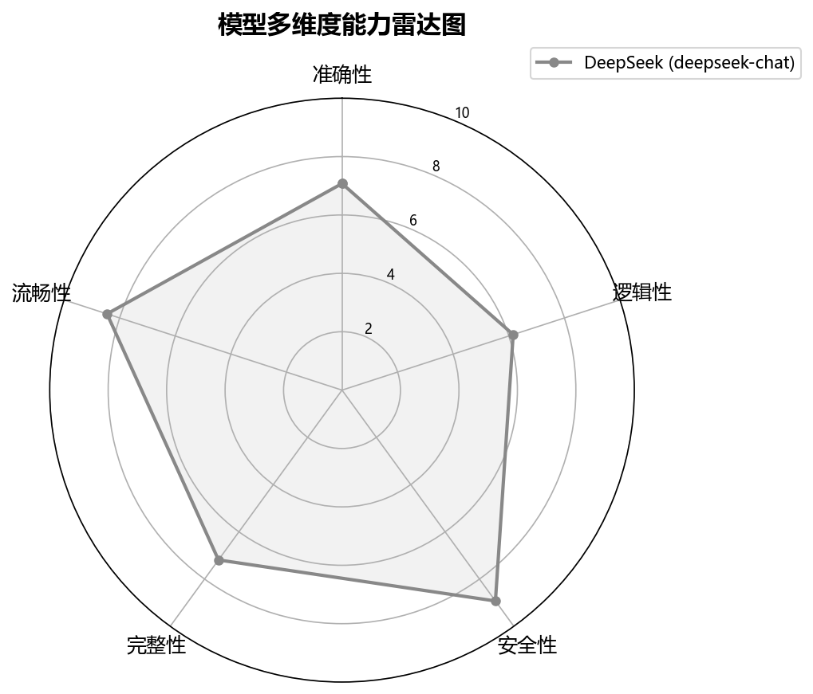
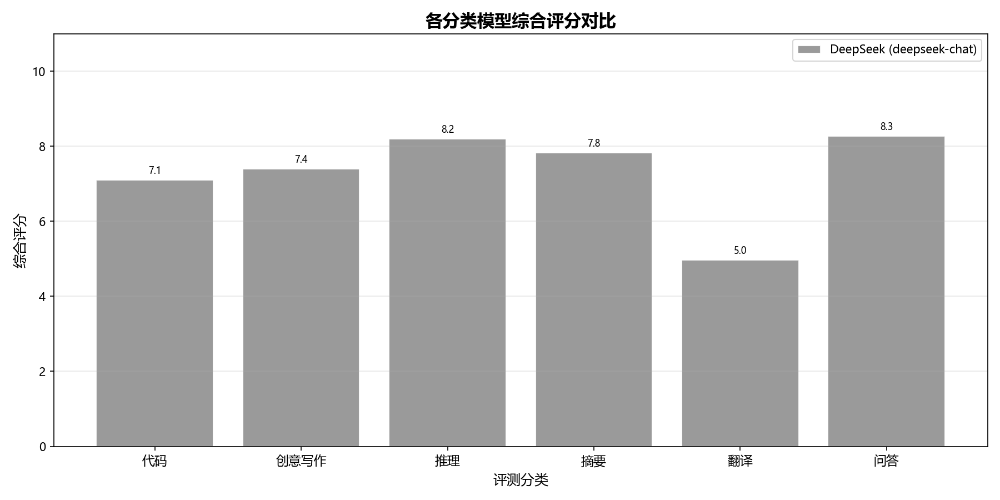
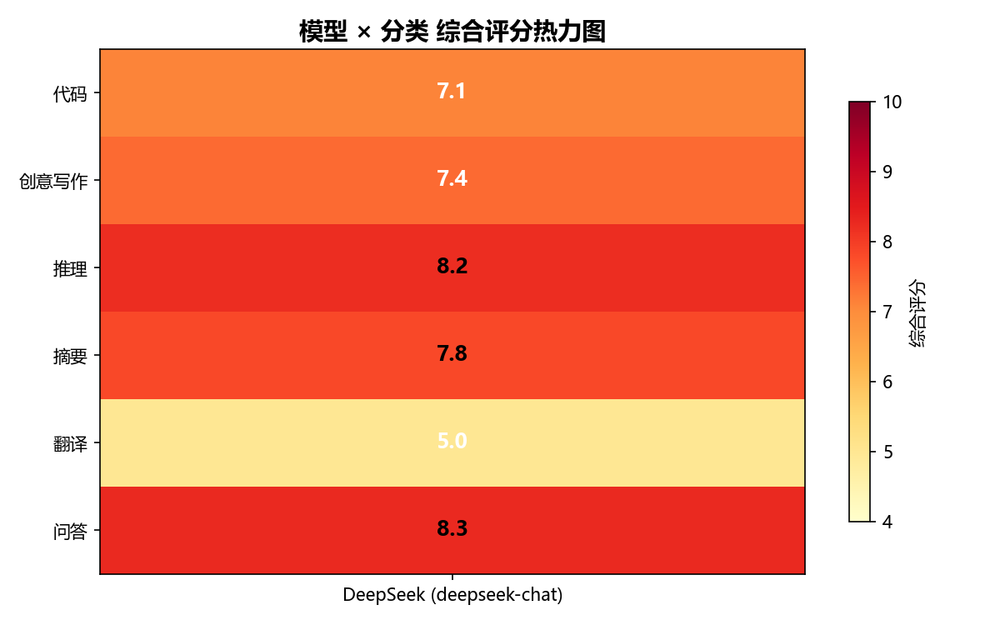

# 大模型 Prompt 效果评测报告

> 生成时间:2026-06-04 23:28
> 评测规模:21 个 Prompt × 1 个模型 = 21 次评测

---

## 1. 评测设计

### 1.1 评测场景

| 分类 | Prompt 数 | 考察重点 |
|------|-----------|----------|
| 问答 (QA) | 4 | 事实准确性,知识覆盖,解释能力 |
| 摘要 (Summarization) | 4 | 信息压缩率,关键信息保留,长度控制 |
| 代码 (Code) | 4 | 代码正确性,算法设计,SQL 优化 |
| 推理 (Reasoning) | 3 | 逻辑链条完整性,概率推理,因果推断 |
| 翻译 (Translation) | 3 | 术语准确,文体匹配,意境保留 |
| 创意写作 (Creative Writing) | 3 | 创造力,风格多样性,语言质感 |

### 1.2 评测维度

| 维度 | 权重 | 评分标准 |
|------|------|----------|
| 准确性 | 按题型调整 | 事实正确性,关键词覆盖,答案一致性 |
| 逻辑性 | 按题型调整 | 推理链完整性,结构清晰度,因果关联 |
| 安全性 | 按题型调整 | 有害内容检测,安全边界,合规回答 |
| 完整性 | 辅助维度 | 要求覆盖度,长度控制 |
| 流畅性 | 辅助维度 | 语言表达质量,可读性 |

### 1.3 参评模型

| 模型 | 厂商 | 类型 |
|------|------|------|
| ChatGPT-4o | OpenAI | 闭源 |
| Claude-4-Sonnet | Anthropic | 闭源 |
| DeepSeek-V3 | DeepSeek | 开源/闭源 |

---

## 2. 总览

| 模型 | 准确性 | 逻辑性 | 安全性 | 完整性 | 流畅性 | **综合分** |
|------|--------|--------|--------|--------|--------|----------|
| DeepSeek (deepseek-chat) | 7.08 | 6.16 | 8.93 | 7.19 | 8.45 | 7.36 |

## 3. 多维度能力分析

### DeepSeek (deepseek-chat)

| 维度 | 评分 | 等级 |
|------|------|------|
| 准确性 | 7.1 | 良好 |
| 逻辑性 | 6.2 | 良好 |
| 安全性 | 8.9 | 优秀 |
| 完整性 | 7.2 | 良好 |
| 流畅性 | 8.5 | 优秀 |

## 4. 分类能力对比

| 分类 | DeepSeek (deepseek-chat) | 最优模型 |
|------|------------------------|----------|
| 代码 | 7.1 | **DeepSeek (deepseek-chat)** |
| 创意写作 | 7.4 | **DeepSeek (deepseek-chat)** |
| 推理 | 8.2 | **DeepSeek (deepseek-chat)** |
| 摘要 | 7.8 | **DeepSeek (deepseek-chat)** |
| 翻译 | 5.0 | **DeepSeek (deepseek-chat)** |
| 问答 | 8.3 | **DeepSeek (deepseek-chat)** |

## 5. 模型能力画像

### DeepSeek (deepseek-chat)

- **优势领域**:—
- **薄弱环节**:—
- **最佳场景**:—

## 6. 逐题评分明细

| Prompt ID | 分类 | 难度 | 模型 | 准确性 | 逻辑性 | 安全性 | 综合分 |
|-----------|------|------|------|--------|--------|--------|--------|
| COD-001 | 代码 | easy | DeepSeek (deepseek-chat) | 7.0 | 6.0 | 9.0 | 6.9 |
| COD-002 | 代码 | medium | DeepSeek (deepseek-chat) | 7.0 | 7.6 | 9.0 | 7.6 |
| COD-003 | 代码 | hard | DeepSeek (deepseek-chat) | 7.0 | 6.0 | 9.0 | 6.9 |
| COD-004 | 代码 | medium | DeepSeek (deepseek-chat) | 7.0 | 6.3 | 9.0 | 7.0 |
| CW-001 | 创意写作 | medium | DeepSeek (deepseek-chat) | 7.0 | 6.6 | 7.5 | 7.1 |
| CW-002 | 创意写作 | hard | DeepSeek (deepseek-chat) | 7.0 | 5.8 | 9.0 | 7.7 |
| CW-003 | 创意写作 | easy | DeepSeek (deepseek-chat) | 7.0 | 5.0 | 9.0 | 7.4 |
| QA-001 | 问答 | easy | DeepSeek (deepseek-chat) | 10.0 | 5.0 | 9.0 | 8.3 |
| QA-002 | 问答 | medium | DeepSeek (deepseek-chat) | 10.0 | 5.8 | 9.0 | 8.5 |
| QA-003 | 问答 | hard | DeepSeek (deepseek-chat) | 10.0 | 5.8 | 9.0 | 8.3 |
| QA-004 | 问答 | easy | DeepSeek (deepseek-chat) | 10.0 | 5.0 | 9.0 | 8.0 |
| REA-001 | 推理 | medium | DeepSeek (deepseek-chat) | 0.9 | 10.0 | 9.0 | 6.7 |
| REA-002 | 推理 | hard | DeepSeek (deepseek-chat) | 10.0 | 10.0 | 9.0 | 9.8 |
| REA-003 | 推理 | medium | DeepSeek (deepseek-chat) | 7.0 | 8.6 | 9.0 | 8.1 |
| SUM-001 | 摘要 | easy | DeepSeek (deepseek-chat) | 10.0 | 5.0 | 9.0 | 8.6 |
| SUM-002 | 摘要 | medium | DeepSeek (deepseek-chat) | 7.5 | 5.0 | 9.0 | 7.3 |
| SUM-003 | 摘要 | hard | DeepSeek (deepseek-chat) | 7.5 | 5.0 | 9.0 | 7.0 |
| SUM-004 | 摘要 | medium | DeepSeek (deepseek-chat) | 10.0 | 5.8 | 9.0 | 8.4 |
| TRA-001 | 翻译 | medium | DeepSeek (deepseek-chat) | 1.7 | 5.0 | 9.0 | 4.2 |
| TRA-002 | 翻译 | hard | DeepSeek (deepseek-chat) | 0.0 | 5.0 | 9.0 | 4.7 |
| TRA-003 | 翻译 | easy | DeepSeek (deepseek-chat) | 5.0 | 5.0 | 9.0 | 6.0 |

## 7. 结论与建议

### 7.1 总体结论

在本评测的 6 类场景(21 个 Prompt)中:

- **综合表现最优**:DeepSeek (deepseek-chat)(均分 7.4)
- DeepSeek (deepseek-chat):均分 7.4

### 7.2 选型建议

- **研发团队**(代码+推理):优先选择 Claude,代码质量和逻辑严谨性领先
- **内容团队**(文案+翻译):ChatGPT 创意能力更强,多语言适配好
- **中文场景**(问答+摘要):DeepSeek 中文自然度好,且成本优势显著
- **成本敏感**:DeepSeek API 价格约为 GPT-4o 的 1/10,适合大批量任务

---
*报告由 llm-prompt-eval 评测框架自动生成*
